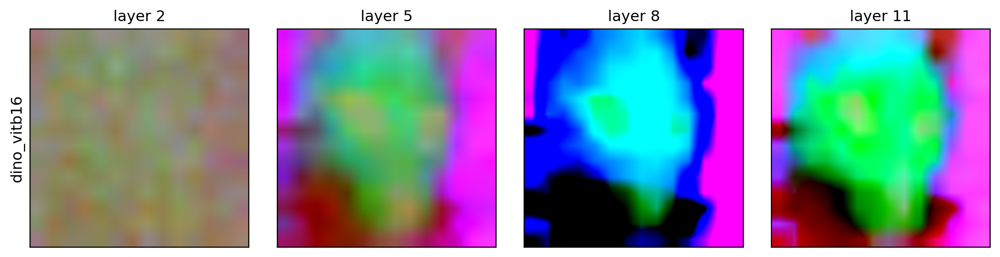
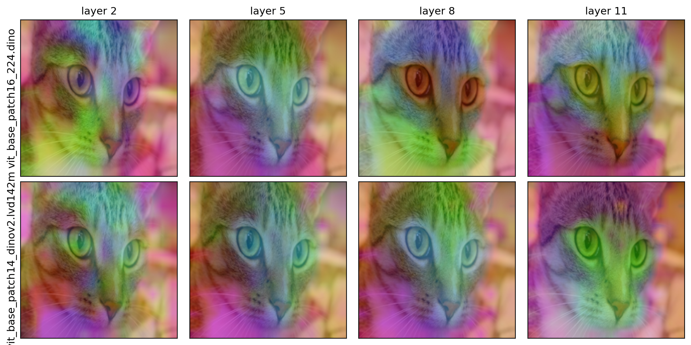
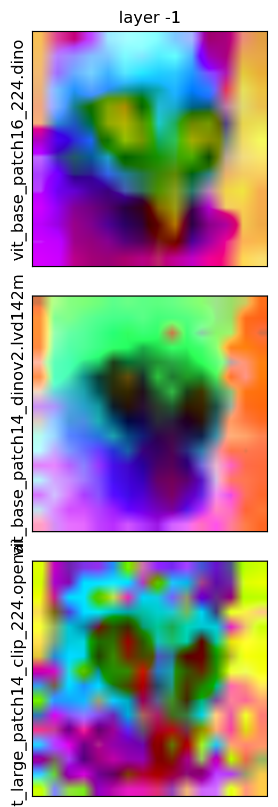
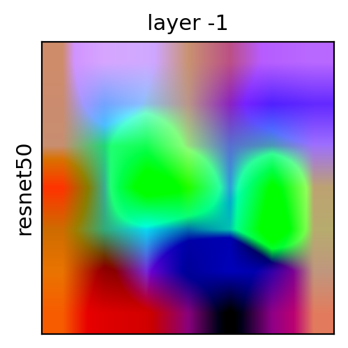

# LayerLens

**See what any vision model encodes.** LayerLens renders PCA-to-RGB **feature maps** for
**any** vision model — DINO, DINOv2/v3, CLIP, SigLIP, MAE, DeiT, V-JEPA, CNNs, … — loaded from
**any** source (timm, HuggingFace `transformers`, `torch.hub`, an external repo, or a model you
built yourself), and from **any layer**, as a clean **model × layer** grid.

<p align="center">
  
</p>

Most "DINO PCA" scripts are welded to one model. LayerLens separates **representation access**
(a small adapter layer over the model zoo) from **visualization** (robust PCA → RGB), so you can
point it at a new model in seconds and compare models/layers side by side.

## Gallery

All produced by `examples/quickstart.py` on the bundled `cat.jpg`.

**`grid(...)` — model × layer, overlaid on the image** (DINO vs DINOv2 across layers 2/5/8/11):

<p align="center"></p>

**`compare(...)` — models at the final layer** &nbsp;|&nbsp; **`custom_adapter` — a ResNet-50 (CNN escape hatch)**

<p align="center">
  
  &nbsp;&nbsp;
  
</p>

## Install

```bash
pip install -e ".[timm]"          # timm backend (DINO, CLIP, SigLIP, DeiT, ...)
# extras: [hf] transformers · [clip] open_clip · [all]
```

Install PyTorch for your platform first (https://pytorch.org).

## Quick start (Python)

```python
import layerlens as ll

# One model, scrub layers (shared PCA basis -> colors comparable across the row)
ll.visualize("dinov2_vitb14", "img.jpg", layers=[2, 5, 8, 11], out="row.png")

# Compare models at the final layer (per-tile basis)
ll.compare(["dino_vitb16", "mae_vitb16", "clip_large_openai"], "img.jpg", layer=-1, out="cmp.png")

# Full model x layer grid, overlaid on the image
ll.grid(["dino_vitb16", "dinov2_vitb14"], "img.jpg", layers=[2, 5, 8, 11], overlay=True, out="grid.png")
```

## Quick start (CLI)

```bash
layerlens --models dino_vitb16 clip_large_openai --layers 2 5 8 11 \
    --images examples/images/cat.jpg --mode grid --out out/grid.png
layerlens --config configs/example.yaml --images examples/images/cat.jpg --out out/grid.png
```

## Model sources

| Source | How to pass it | Needs |
|--------|----------------|-------|
| **timm** | friendly name (`dinov2_vitb14`) or raw id (`vit_base_patch16_224`) | `[timm]` |
| **HuggingFace** | `hf:facebook/dinov2-base` | `[hf]` |
| **torch.hub (V-JEPA)** | `vjepa2_vitl16` | network for weights |
| **External repo** (VGGT/SPA/…) | `external_adapter.load(repo_dir, builder, hook_target=…)` | the cloned repo |
| **Your own model** | `custom_adapter.load(model, feature_fn=…)` | — |

Friendly names (see `layerlens/registry.py`) cover DINO, DINOv2/v3, CLIP, SigLIP, MAE, DeiT,
Perception Encoder and V-JEPA; any other timm id works directly.

## Layers

`layers=[2, 5, 8, 11]` selects **transformer block indices** (0-based, **negatives allowed**,
`-1` = last). The same convention holds across backends — for HuggingFace models LayerLens maps
block `i` to `hidden_states[i+1]` (skipping the embedding output) for you.

## Bring your own model

Anything that isn't built in works through the escape hatch — give a feature function or a hook
target. CNNs work for free (their conv map is already spatial):

```python
import torch.nn as nn, torchvision
from layerlens import FeatureExtractor, FeatureGrid
from layerlens.adapters import custom_adapter

resnet = torchvision.models.resnet50(weights="DEFAULT")
trunk = nn.Sequential(*list(resnet.children())[:-2])           # -> [B, 2048, h, w]
lm = custom_adapter.load(trunk, patch_size=32, feature_fn=lambda m, x: m(x), name="resnet50")
FeatureGrid([FeatureExtractor(lm)]).render("img.jpg", out_path="resnet50.png")
```

For a model in its own repo, `external_adapter.load(repo_dir, builder, hook_target="blocks")`
puts the repo on `sys.path`, builds the model, and hooks its blocks.

## How it works

1. **Adapters** resolve a spec → a `LoadedModel` and drive extraction in one of three modes:
   forward **hooks** on per-block modules (ViTs/CNNs/V-JEPA), HF **`output_hidden_states`**, or a
   user **callable**.
2. `tokens_to_grid` normalizes whatever a layer emits (`[B,N,D]` tokens with optional
   CLS/register prefixes, or `[B,D,h,w]` maps) into a dense `[B,D,h,w]` grid.
3. **Robust PCA** (median-absolute-deviation outlier filtering) projects features to RGB;
   `FeatureGrid` lays out the model × layer tiles with a per-tile or shared-per-model basis.

The extraction core adapts the `FrozenBackbone` pattern; the PCA is adapted from the SpaRRTa
feature-map script.

## License

[MIT](LICENSE).
